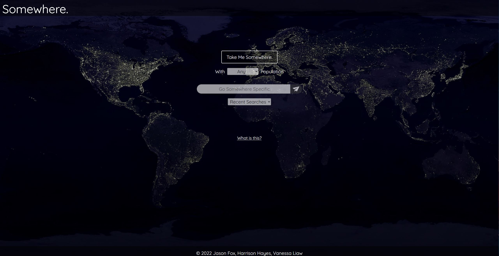
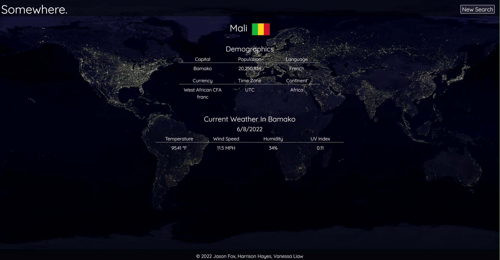

# Somewhere.

## Table of Contents
1. [Description](#description)
2. [Usage](#usage)
3. [Visuals](#visuals)
4. [Resources](#resources)
5. [Authors](#authors)

## Description
“Somewhere.” is a website that will take the user to a random country or to a country they search for. This project focuses heavily on the visual aspects to provide a unique user experience that combines aesthetics with information delivery.

## Usage:
- Click the "Take Me Somewhere" button to generate a random country
- Use the first drop down to select a maximum population for the country you wish to search or randomly generate
- Use the search bar to search for a specific country by name
- Use the recent searches to view your recent searches, click them to quickly search for them again
- When viewing a countries information, use the "New Search" button to return to the landing page

## Visuals:

## Resources:
- [Online Repository](https://github.com/jsonFox/somewhere-project)
- [Live Site](https://jsonfox.github.io/somewhere-project/)

## Authors:
- Jason Fox
- Harrison Hayes
- Vanessa Liaw
